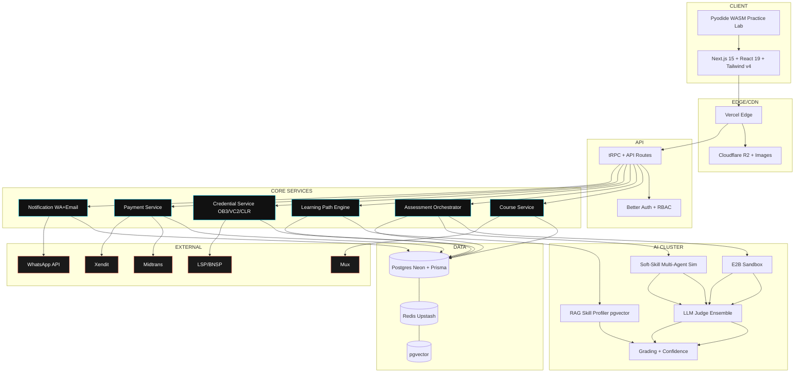

# CareerBright — Master Build Plan
> Indonesia AI-Powered Career Readiness Platform for College Students
> Version: 1.0 | Date: 2026-10-01 | Status: APPROVED FOR IMPLEMENTATION

## 0. Decisions Locked
- **Roles:** Launch ALL 7 categories: Tech/Digital, Green/Sustainability, Finance/Accounting, Project Management, Mining/Energy, Digital Marketing/Creative, Sales/BD
- **Pricing:** Free tier (platform credentials) → Paid upgrade activated in dashboard (LSP/BNSP pathway)
- **Region:** Big cities first: Jakarta, Surabaya, Bandung, Medan, Semarang, Makassar
- **Language:** Bilingual ID/EN from day 1 (next-intl, default `id`, fallback `en`)
- **Target:** College students (S1/D3/D4). UX entry: "What do you want to become?"
- **Credentials:** Platform = Open Badges 3.0 + W3C VC 2.0 + CLR 2.0. Official = LSP/BNSP upgrade.

## 1. PRD Summary
**Problem:** 48% grads feel unprepared; only 30% get field-relevant jobs; 7.28M unemployed (BPS 2025); youth unemployment 16.16%; job openings/applicant -11% YoY; AI disrupting 23% of jobs (WEF).
**Solution:** Role-based learning paths mapped to SKKNI/KKNI, AI-graded assessments (code + soft-skill sim + project), stackable micro-credentials + LSP upgrade, employer-verifiable skill profiles.
**Users:** Student (primary), Instructor, Admin, LSP Assessor, Employer, University Career Center.
**Differentiators:** 1) SKKNI-native 2) AI-first assessment 3) Role→salary→demand→KKNI selector 4) ID payments + WA 5) Awwwards-level dark editorial design.

## 2. Trending Roles (Source: LinkedIn Grad Guide 2025, Jobstreet, Michael Page, BPS)
### 2.1 Top 10 Fastest-Growing for Grads
1. AI Engineer (IDR 12-25M) 2. SOC Analyst (8-18M) 3. EHS Specialist (7-15M, +54.6% hirable with green skills) 4. Import Specialist 5. Field Specialist 6. Industrial Engineer 7. Procurement Specialist 8. L&D Specialist 9. Partnerships Specialist 10. Store Assistant/MT
### 2.2 Full Path Catalog (MVP = all 7)
- **TECH:** Backend, Fullstack, Mobile Flutter/RN, DevOps, Data Analyst, Data Scientist, ML Engineer, Data Engineer, SOC Analyst, Pentester, Cloud Engineer, SRE, PM-Product, UX/UI
- **GREEN:** EHS/HSE, Sustainability/ESG Analyst, Renewable Energy Engineer, Waste Mgmt, Green Building Consultant
- **FINANCE:** Accountant (M.691090), Tax Consultant (Brevet A/B/C), Internal Auditor (CIA/CISA), Financial Analyst (CFA L1)
- **PM:** IT PM, Construction PM, Digital PM, Project Coordinator (CAPM→PMP/PSM)
- **MINING:** Mining Coordinator, Mining PM (nickel), HSE, Geotechnical, Heavy Equipment Coordinator
- **MARKETING:** Performance Marketing (SKKNI 124/2022), E-commerce/Live Commerce, Content Strategist, Marketing Analytics
- **SALES:** B2B Sales, Partnerships/BD, Account Management
### 2.3 Role Card Data Model
`slug, title_id, title_en, category, targetKkniLevel, salaryMin, salaryMax, demandLevel, estimatedWeeks, hiringCompanies[], skkniCodes[], lspPartnerId, lspCertPrice`

## 3. Architecture
### 3.1 Stack (Latest)
- Frontend: Next.js 15 App Router + React 19 + TypeScript strict + Tailwind v4 + shadcn/ui (custom theme, no default look) + next-intl + Zustand + Zod
- Motion: Motion (`motion/react`) for reveals + GSAP ScrollTrigger for pin/scrub only. `useMotionValue`, no scroll listeners.
- Backend: tRPC + Next.js Route Handlers, Prisma ORM, Better Auth (phone/WA OTP, passkeys, RBAC)
- Data: PostgreSQL (Neon, Jakarta region) + pgvector (RAG), Redis Upstash (cache/session/queue)
- Video: Mux (HLS + signed URLs) + Cloudflare R2
- Code Exec: Pyodide (browser practice) + E2B/Daytona (server graded sandbox)
- AI: Model-agnostic gateway → OpenAI o1/GPT-4o + Anthropic Claude + Local Ollama fallback. LLM-as-Judge ensemble + BERTScore.
- Comms: WhatsApp Business API (Gupshup/Wati) + Resend + React Email (ID/EN templates)
- Analytics/Obs: PostHog + Vercel Analytics + Sentry + Axiom + Grafana
- Deploy: Vercel (web) + Railway (services), Turborepo monorepo, GitHub Actions CI/CD

### 3.2 Architecture Diagram (Mermaid)


### 3.3 Monorepo Layout to Create
```
apps/web (Next.js 15)
packages/ui (shadcn custom + tokens)
packages/db (prisma schema + seed skkni.json)
packages/ai (judge ensemble, rubric, e2b client, rag)
packages/credentials (OB3.0 + VC2.0 + CLR + QR + PDF)
packages/payments (midtrans + xendit + webhooks)
packages/notify (wa + email templates id/en)
packages/i18n (next-intl dictionaries)
```

## 4. Database (Prisma — Full Schema to Implement)
Models to create: CompetencyFramework, CompetencyUnit, Course, Module, Lesson, LessonAttachment, LessonCompletion, CourseCompetency, LearningPath, LearningPathCompetency, LearningPathCourse, LearningPathMilestone, UserLearningPath, Assessment (CODE_CHALLENGE, SOFT_SKILL_SIM, PROJECT, MCQ, PORTFOLIO + aiConfig + testCases + scenarioConfig), AssessmentSubmission (score, feedback JSON, confidence, gradedBy AI/HUMAN/HYBRID), User (role: STUDENT/INSTRUCTOR/ADMIN/LSP_ASSESSOR/EMPLOYER/UNIVERSITY + nik + ktpVerified + phone/whatsapp + theme/language/timezone), Enrollment, Review, Certification/Credential (vcJson, obJson, clrJson, verificationUrl, qrCodeUrl, pdfUrl, lspId, bnspVerified), Order + OrderItem (MIDTRANS/XENDIT), UserSkillProfile (skills JSON + softSkills + aiSummary).
Seed: 194 SKKNI frameworks → JSON seed script `packages/db/seed/skkni.json`.

## 5. AI Assessment (Judged by AI — Latest Trend, Synergized)
- **Code:** Pyodide instant practice → E2B graded (no net, CPU/mem/timeout, hidden tests). Grade dims: correctness, efficiency, style (lint), architecture. Plagiarism: AST + embedding sim.
- **Soft-skill:** Multi-agent voice/text sim (Client, Manager, Difficult Stakeholder). Competencies: communication, empathy, negotiation, adaptability, leadership. Psycholinguistic + Big5 + Indonesian workplace norms rubric.
- **Project:** RAG portfolio review vs SKKNI evidence requirements.
- **Judge:** Ensemble 3 evaluators (GPT-4o, Claude, local). Consensus + BERTScore. Confidence <0.7 → human review queue. Full audit trail. Prompt versioning.
- **Anti-cheat:** Face-check liveness (optional), tab-switch detection, code similarity, time anomaly.

## 6. Credentials on Completion (College-Student Best Approach)
- **Per-milestone:** Open Badge 3.0 auto-issued + wallet + LinkedIn share + PDF.
- **Per-path complete:** W3C VC 2.0 + CLR 2.0 bundle + Comprehensive Learner Record + public `/verify/[id]` + QR.
- **Paid upgrade in dashboard:** "Upgrade to BNSP Certificate (IDR 1.25M)" → pay via Midtrans → schedule LSP TUK/online proctor → LSP issues BNSP cert → `bnspVerified=true` + dual display.
- **Tech:** `@veramo/core` DID:web, `openbadges-validator`, `@react-pdf/renderer`, `qrcode`.
- **Verification portal:** `apps/web/app/[locale]/verify/[id]` public, bilingual, shows SKKNI codes, KKNI level, LSP logo if certified.

## 7. Third-Party Integrations Checklist
- [ ] Midtrans Core API + Snap + webhook (`/api/webhooks/midtrans`) — GoPay, QRIS, VA, CC, Alfamart/Indomaret
- [ ] Xendit Payments + Invoice + Payout (instructor disbursement) + webhook
- [ ] WhatsApp Business (Gupshup/Wati): OTP, enrollment, reminder, cert issued, payment templates ID/EN
- [ ] Mux: direct upload, webhook processing done, signed playback
- [ ] Resend: welcome, enrollment, completion, receipt, cert (React Email)
- [ ] PostHog: funnels (select role → enroll → complete → upgrade), feature flags
- [ ] Sentry + Axiom: tracing assessment pipeline
- [ ] Simple Icons CDN for trust-bar logos (no text wordmarks)

## 8. DASHBOARDS — Full Backend Integration (Do Not Forget)
### 8.1 Student Dashboard `/dashboard`
- Overview: active paths, % progress, streak, next milestone, skill radar (vs target role), wallet preview
- My Learning: enrollments table, resume lesson (Mux player + completion API), time-spent
- Assessments: pending/graded, attempt count, AI feedback viewer (per-rubric), request human review
- Credentials/Wallet: badges grid, pathway VC+CLR, Download PDF, Share LinkedIn, Verify link, **Upgrade to LSP button → Midtrans Snap modal → Order status polling**
- Skill Profile: auto RAG summary, SKKNI coverage map, employer-share toggle
- Billing: orders, invoices, receipts (Midtrans/Xendit webhook-synced)
- Settings: bilingual toggle, theme, WA/phone verify, NIK e-KYC for LSP
- APIs: `learningPath.progress`, `lesson.complete`, `assessment.submit`, `credential.issue`, `order.create`, `payment.webhook`

### 8.2 Instructor Dashboard `/instructor`
- Course Studio: Course→Module→Lesson CRUD, EditorJS + KaTeX, Mux upload, drag reorder, SKKNI mapper (CourseCompetency)
- Assessment Builder: type selector, rubric builder, testCases editor, scenario/persona config, aiConfig (model, temp, maxAttempts, passingScore)
- Grading Queue: AI-graded list with confidence filter, override score, human feedback, bulk approve
- Students: enrollment table, progress %, at-risk flag, WA nudge
- Revenue: enrollments, Midtrans/Xendit split, Xendit payout status
- APIs: `course.*`, `assessment.*`, `submission.review`, `payout.*`

### 8.3 Admin Dashboard `/admin`
- KPIs: MAU, enrollments, completion %, upgrade conversion %, MRR, AI cost per grading
- Catalog: approve/publish courses, manage LearningPaths + milestones + SKKNI codes
- Users: roles, ktpVerified, ban/suspend, impersonate (audit logged)
- LSP Partners: CRUD, TUK slots, cert issuance log, bnspVerified sync
- Orders/Payments: Midtrans/Xendit reconciliation, refunds, disputes
- Content Moderation + Feature flags + Audit logs
- APIs: everything admin-scoped, Grafana embedded

### 8.4 LSP Assessor Dashboard `/lsp`
- Assessment sessions (TUK/online), candidate APL-02 verification, rubric scoring, approve/reject → triggers `credential.bNSPIssue`
- QR + certificate number issuance, revocation

### 8.5 Employer Dashboard `/employer`
- Search skill profiles by SKKNI/KKNI/role, verify credential via `/verify/[id]`, post jobs, shortlist

### 8.6 University Dashboard `/university`
- Cohort analytics, curriculum→SKKNI gap map, completion export, white-label view

All dashboards: server components + isolated `use client` leaves, skeleton loaders, empty/error states, WCAG AA, `min-h-[100dvh]`, Indonesian phone formatting, IDR formatting.

## 9. Design System (Awwwards-level, NOT Coursera clone)
- Read: Premium ID EdTech for students, dark-editorial cinematic, custom Tailwind + Geist/Geist Mono
- Dials: VARIANCE 8 / MOTION 6 / DENSITY 4
- Theme: Deep Dark zinc-950, accent Cyan #00D4FF + Coral #FF6B5B, off-black no pure black, 1 accent locked
- Type: Geist Display headlines (max 2 lines), body max 65ch, mono for numbers/code
- Landing 8 sections: 1 Hero bottom-left over full-bleed + live terminal 2 Trust bar (real logos) 3 Role Pathways bento 4 AI Demo split 5 SKKNI tree interactive 6 Outcomes sticky-stack 7 Pricing mini + IDR toggle 8 CTA + WA capture + footer
- Rules: max 1 eyebrow/3 sections, no 3-equal-cards, no wrapped CTA, single-line nav ≤72px, hero fits viewport, `prefers-reduced-motion` honored, light+dark QA.

## 10. Bilingual + Regional
- `next-intl` dictionaries `id`/`en`, all certs bilingual, WA templates bilingual, IDR formatting `id-ID`.
- Wave 1: Jakarta, Surabaya, Bandung. Wave 2: Medan, Semarang, Makassar. City filter on roles + TUK availability.

## 11. Roadmap + Build Checklist (20 weeks)
- [ ] Phase 0 (2w): turborepo, prisma+seed, Better Auth phone/WA, tokens, CI/CD
- [ ] Phase 1 (4w): Course CRUD, EditorJS, Mux, student dash progress, Midtrans Snap+webhook, MCQ+Pyodide lab
- [ ] Phase 2 (4w): E2B, LLM ensemble, rubric builder, soft-skill sim, confidence queue
- [ ] Phase 3 (3w): SKKNI import, mapper UI, 20+ paths (all 7 cats), RAG profiler, employer view
- [ ] Phase 4 (3w): OB3/VC2/CLR issuance, `/verify/[id]`, PDF+QR, wallet, LSP pilot (Ditekindo + K3), dashboard upgrade flow
- [ ] Phase 5 (4w): landing 8 sect + GSAP, a11y AA, load 10k, sec audit, soft launch 3 univs, public launch
- Cost at 10k MAU ~$469/mo; 100k ~$4.4k + gateway 2-3%.

## 12. Open Questions for Owner
1. LSP pilot: approve Ditekindo (tech) + LSP K3 (green/mining) for pilot?
2. University soft-launch contacts?
3. Initial content: internal vs hired instructors?
4. Team size + AI API budget cap?
5. Brand assets or generate via brandkit?
